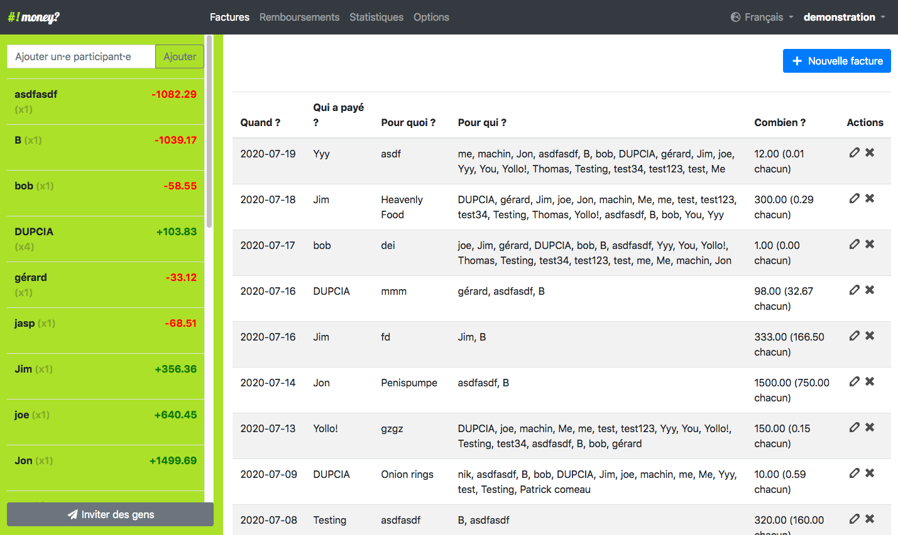

# I hate money for YunoHost

[](https://dash.yunohost.org/appci/app/ihatemoney)    
[](https://install-app.yunohost.org/?app=ihatemoney)

*[Lire ce readme en français.](./README_fr.md)*

> *This package allows you to install I hate money quickly and simply on a YunoHost server.  
If you don't have YunoHost, please consult [the guide](https://yunohost.org/#/install) to learn how to install it.*

## Overview
I hate money is a web application made to ease shared budget management. It keeps track of who bought what, when, and for whom; and helps to settle the bills.

**Shipped version:** 4.1.3

## Screenshots



## Demo

* [Official demo](https://ihatemoney.org/)

## Configuration

How to configure this app: From an admin panel, a plain file with SSH, or any other way.

## Documentation

 * Official documentation: Link to the official documentation of this app
 * YunoHost documentation: If specific documentation is needed, feel free to contribute.

## YunoHost specific features

Backs on MySQL database, the identifiers are per-project, not per-user, so no
way to do advanced SSO integration with yunohost accounts.

The behaviour is either:

- **non-public app**:
  - yunohost login required
  - per-project identifiers required
  - any yunohost user with authorized access to the app can create a new
    project).
- **public app** :
  - no yunohost login required
  - per-project identifiers required
  - any visitor can create a new project.

#### Multi-user support

* Are LDAP and HTTP auth supported?
* Can the app be used by multiple users?

#### Supported architectures

* x86-64 - [](https://ci-apps.yunohost.org/ci/apps/ihatemoney/)
* ARMv8-A - [](https://ci-apps-arm.yunohost.org/ci/apps/ihatemoney/)

## Limitations

* Any known limitations.

## Additional information

* Other info you would like to add about this app.

## Links

 * Report a bug: https://github.com/YunoHost-Apps/ihatemoney_ynh/issues
 * App website: Link to the official website of this app.
 * Upstream app repository: https://github.com/spiral-project/ihatemoney/
 * YunoHost website: https://yunohost.org/

---

## Developer info

Please send your pull request to the [testing branch](https://github.com/YunoHost-Apps/ihatemoney_ynh/tree/testing).

To try the testing branch, please proceed like that.
```
sudo yunohost app install https://github.com/YunoHost-Apps/ihatemoney_ynh/tree/testing --debug
or
sudo yunohost app upgrade ihatemoney -u https://github.com/YunoHost-Apps/ihatemoney_ynh/tree/testing --debug
```
