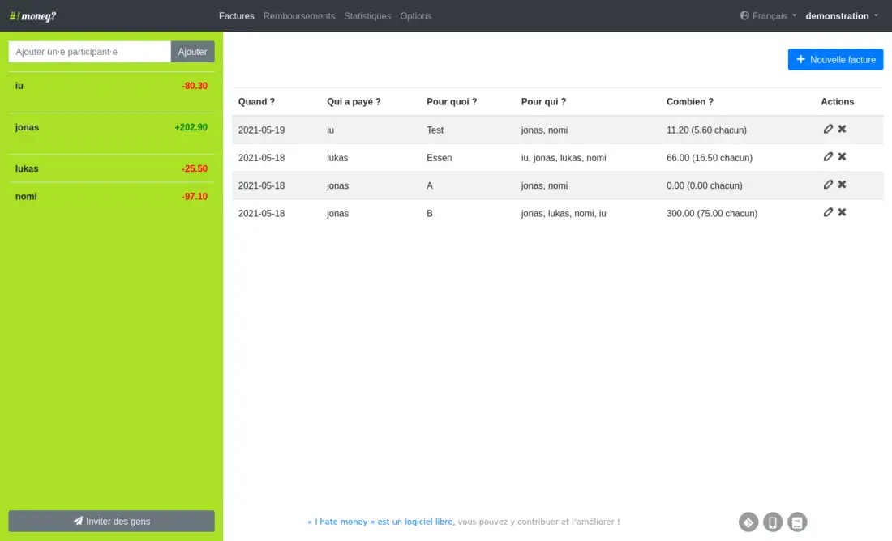

<!--
N.B.: Aquest README ha estat generat automàticament per <https://github.com/YunoHost/apps/tree/master/tools/readme_generator>
NO s'ha de modificar manualment.
-->

# I Hate Money per YunoHost

[](https://ci-apps.yunohost.org/ci/apps/ihatemoney/)


[](https://install-app.yunohost.org/?app=ihatemoney)

*[Llegeix aquest README en altres idiomes.](./ALL_README.md)*

> *Aquest paquet et permet instal·lar I Hate Money de forma ràpida i senzilla en un servidor YunoHost.*  
> *Si no tens YunoHost, consulta [la guia](https://yunohost.org/install) per saber com instal·lar-lo.*

## Visió general

I hate money is a web application made to ease shared budget management. It keeps track of who bought what, when, and for whom; and helps to settle the bills.


**Versió inclosa:** 6.1.3~ynh2

**Demo:** <https://ihatemoney.org/demo/>

## Captures de pantalla



## Documentació i recursos

- Lloc web oficial de l'aplicació: <http://ihatemoney.org/>
- Documentació oficial per l'administrador: <https://ihatemoney.readthedocs.org/>
- Repositori oficial del codi de l'aplicació: <https://github.com/spiral-project/ihatemoney>
- Botiga YunoHost: <https://apps.yunohost.org/app/ihatemoney>
- Reportar un error: <https://github.com/YunoHost-Apps/ihatemoney_ynh/issues>

## Informació per a desenvolupadors

Envieu les pull request a la [branca `testing`](https://github.com/YunoHost-Apps/ihatemoney_ynh/tree/testing).

Per provar la branca `testing`, procedir com descrit a continuació:

```bash
sudo yunohost app install https://github.com/YunoHost-Apps/ihatemoney_ynh/tree/testing --debug
o
sudo yunohost app upgrade ihatemoney -u https://github.com/YunoHost-Apps/ihatemoney_ynh/tree/testing --debug
```

**Més informació sobre l'empaquetatge d'aplicacions:** <https://yunohost.org/packaging_apps>
