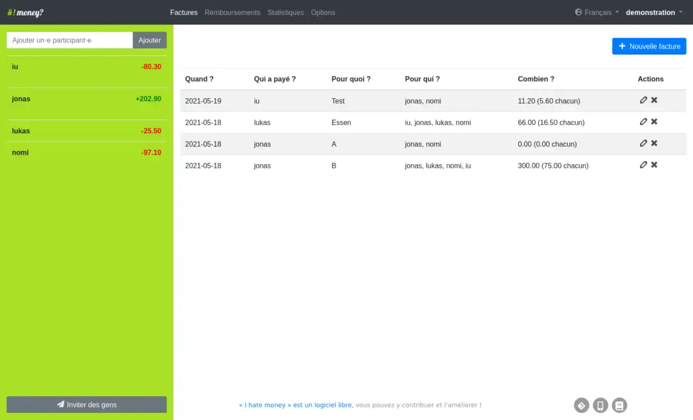
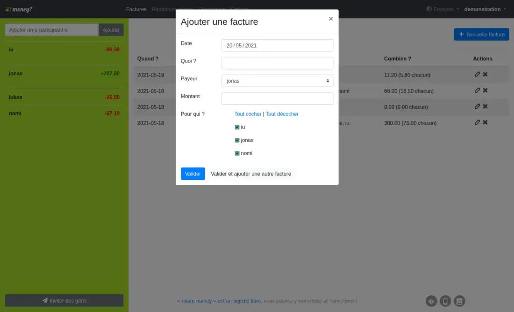

# I Hate Money pour YunoHost

[](https://dash.yunohost.org/appci/app/ihatemoney)  
[](https://install-app.yunohost.org/?app=ihatemoney)

*[Read this readme in english.](./README.md)*
*[Lire ce readme en français.](./README_fr.md)*

> *Ce package vous permet d'installer I Hate Money rapidement et simplement sur un serveur YunoHost.
Si vous n'avez pas YunoHost, consultez [le guide](https://yunohost.org/#/install) pour apprendre comment l'installer.*

## Vue d'ensemble

Une application web de comptes partagés à plusieurs

**Version incluse:** 4.1.5~ynh2

## Captures d'écran




## Avertissements / informations importantes

* L'authentification LDAP et HTTP est-elle prise en charge ? **Non**

L'authentification est par projet (et non par utilisateur) donc ce n'est pas intégrable dans le système d'authentification de Yunohost.

L'application peut néanmoins être configurée en public ou non :

- **app non publique**:
  - authentification Yunohost requise
  - identifiants de projets requis
  - Tout utilisateur Yunohost avec accès à l'app peut créer un nouveau projet.
- **app publique** :
  - authentification Yunohost non requise
  - identifiants de projets requis
  - Tout visiteur peut créer un nouveau projet.

## Documentations et ressources

* Site officiel de l'app : https://github.com/spiral-project/ihatemoney
* Documentation officielle de l'admin: https://ihatemoney.readthedocs.org/
* Dépôt de code officiel de l'app:  https://github.com/spiral-project/ihatemoney
* Documentation YunoHost pour cette app: https://yunohost.org/app_ihatemoney
* Signaler un bug: https://github.com/YunoHost-Apps/ihatemoney_ynh/issues

## Informations pour les développeurs

Merci de faire vos pull request sur la [branche testing](https://github.com/YunoHost-Apps/ihatemoney_ynh/tree/testing).

Pour essayer la branche testing, procédez comme suit.
```
sudo yunohost app install https://github.com/YunoHost-Apps/ihatemoney_ynh/tree/testing --debug
or
sudo yunohost app upgrade ihatemoney -u https://github.com/YunoHost-Apps/ihatemoney_ynh/tree/testing --debug
```

**Plus d'infos sur le packaging d'applications:** https://yunohost.org/packaging_apps